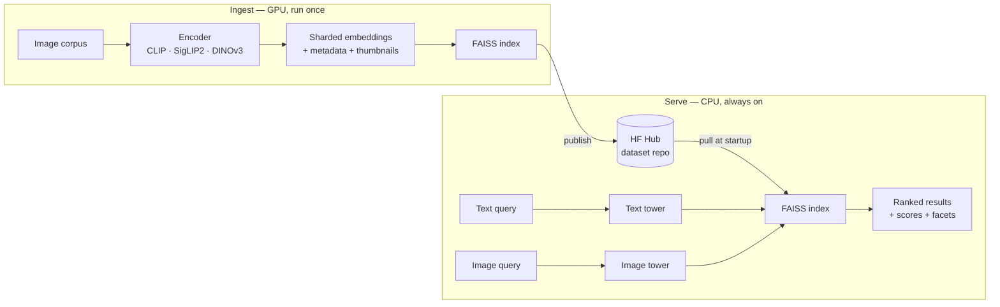

# Multimodal Visual Search

Search a large image collection two ways — by **natural language** ("red leather ankle boots on a
white background") or **by example image** ("find me more like this") — and get back ranked, scored
results in a web UI.

Built on vision foundation models, with an explicit focus on the dimension most CV portfolios skip:
**efficiency, deployment, and honest measurement**. Every speed number below is paired with the
retrieval fidelity it cost.

```bash
uv sync --all-extras --group dev && uv run vsearch info
```

---

## What it does

| | |
|---|---|
| **Text → image** | CLIP / SigLIP2 shared embedding space |
| **Image → image** | DINOv3 self-supervised features, or fused with CLIP via reciprocal rank fusion |
| **Filtering** | Facet pre-filtering *inside* the FAISS search (colour, category, gender, season…) |
| **Serving** | FastAPI + Gradio in one process, ~45 ms/query on a laptop CPU |

Real results from the running system on the product corpus:

```
query: "silver wrist watch"
  0.302  Titan Women Silver Watch                            [Silver]
  0.299  Carrera Men Dial steel finish strap Silver Watches   [Silver]
  0.298  CASIO EDIFICE Men Black Dial Chronograph Watch       [Black]
```

---

## Architecture

Ingestion is a GPU-bound one-time batch job. Serving a query is a CPU-bound latency job. Treating
them as one program forces you to rent a GPU for a workload that is 99 % idle.



The Space never re-embeds a corpus: cold start is seconds, hosting is free, and ingestion is
reproducible rather than something that happened once on a laptop.

---

## Stack

| Layer | Choice | Why |
|---|---|---|
| Text↔image | `openai/clip-vit-base-patch32` | 512-dim, ungated, fast on CPU |
| Text↔image (quality) | `google/siglip2-base-patch16-224` | Stronger recall, slower |
| Image↔image | `facebook/dinov3-vits16-pretrain-lvd1689m` | Self-supervised, 21 M params |
| Image↔image fallback | `facebook/dinov2-small` | DINOv3 is licence-gated; the registry degrades instead of failing |
| Index | FAISS `IndexFlatIP` / `IndexHNSWFlat` | Native Windows wheels, no service to run |
| Runtime | PyTorch + ONNX Runtime | Both behind one encoder interface |
| API / UI | FastAPI + Gradio | One process, one loaded model |
| Packaging | uv + Docker | One-command setup |

Every embedding leaves an encoder **L2-normalised float32**, enforced in one place. Cosine
similarity is then a plain inner product, so `IndexFlatIP` returns cosine scores directly and two
encoders' scores stay comparable.

---

## Corpora

| Role | Dataset | Size |
|---|---|---|
| Demo | [`benitomartin/fashion-product-images-small-384x512`](https://huggingface.co/datasets/benitomartin/fashion-product-images-small-384x512) | 44,072 @ 384×512, 8 facets |
| Evaluation | [`nlphuji/flickr30k`](https://huggingface.co/datasets/nlphuji/flickr30k) | 31,014 images, 5 captions each |

Flickr30k carries the canonical train/val/test assignment, so restricting to `test` gives the
standard 1000-image / 5000-caption benchmark whose Recall@k is comparable to published CLIP numbers
rather than self-defined.

---

## Benchmarks

CLIP ViT-B/32, Intel i7-1255U (10C/12T, no AVX-512), ONNX Runtime threads pinned to 4, 20 runs,
p50 / p95 over warmed iterations.

| runtime | precision | modality | batch | p50 ms | p95 ms | items/s | model MB | parity vs fp32 |
|---|---|---|---|---|---|---|---|---|
| pytorch | fp32 | image | 1 | 69.9 | 120.2 | 13.8 | — | 1.0000 |
| pytorch | fp32 | image | 8 | 347.8 | 451.9 | 22.6 | — | 1.0000 |
| pytorch | fp32 | text | 4 | 30.8 | 44.4 | 127.9 | — | 1.0000 |
| onnxruntime | fp32 | image | 1 | 78.1 | 91.6 | 12.6 | 335 | 1.0000 |
| onnxruntime | fp32 | image | 8 | 506.1 | 553.4 | 15.6 | 335 | 1.0000 |
| onnxruntime | fp32 | text | 4 | 27.8 | 31.3 | 144.5 | 242 | 1.0000 |
| **onnxruntime** | **int8** | **image** | **1** | **55.4** | **68.5** | **16.8** | **84** | **0.9764** |
| onnxruntime | int8 | image | 8 | 354.1 | 369.7 | 22.5 | 84 | 0.9764 |
| onnxruntime | int8 | text | 4 | 14.3 | 16.4 | 282.3 | 61 | **0.8830** |

**Parity** is the mean cosine between a backend's embeddings and the PyTorch fp32 baseline. A
speedup without it is not a result: the index is built in fp32, so a backend that drifts is
answering a different question than the one the index was built for.

### What the numbers actually say

1. **ONNX fp32 is slower than PyTorch here** — 78 vs 70 ms at batch 1, and 506 vs 348 ms at batch 8.
   PyTorch's oneDNN CPU path is very well tuned for Intel and ORT's MLAS does not beat it for
   ViT-B/32 on this chip. "We exported to ONNX and got faster" would have been false.

2. **INT8 is the only real speedup, and only at batch 1** — 55.4 ms vs 69.9 ms (1.26×), at 0.976
   parity. At batch 8 it draws level with PyTorch.

3. **INT8 text is 2.15× faster but drops to 0.883 parity.** That is a large drift against an fp32
   index, and it would move Recall@k.

4. **Model size falls 335 MB → 84 MB (4×)** — the unambiguous win, and the one that matters most on
   a 2-vCPU / 16 GB Space.

**Conclusion: mixed precision, not blanket INT8.** Quantize the *vision* tower — it runs once per
corpus image, quantizes cleanly at 0.976, and drives the 4× size reduction. Keep the *text* tower in
fp32 — it runs once per query, so its 16 ms saving is worth little, while 0.883 parity is expensive.

Reproduce:

```bash
uv run python -m vsearch.bench.run_bench --encoder clip --batch 1 --batch 8 --runs 20 --threads 4
```

---

## Retrieval quality

Image→image on the product corpus. Relevance is a **documented proxy**: two products match when
they share `articleType` *and* `baseColour`. This is not human judgement, and the table says so.

| config | queries | R@1 | R@5 | R@10 | MRR | mAP | nDCG@10 |
|---|---|---|---|---|---|---|---|
| clip / fashion / image→image (label proxy) | 39 | 0.158 | 0.547 | 0.718 | 0.445 | 0.398 | 0.490 |

Two caveats stated plainly:

- This ran against a **96-image smoke index**, not the full 44 k corpus. It demonstrates the harness
  end to end; it is not a headline result.
- R@1 looks low because with many relevant items Recall@1 is capped at `1/|relevant|`. For this
  protocol **mAP and nDCG are the honest summaries**, which is why both are reported.

Queries whose item has no label-matched peer are skipped as unscoreable — counting them as 0 would
understate the system, as 1 would overstate it.

**Text→image Recall@k on the Flickr30k 1000-image test split is not yet measured.** It needs the
full corpus ingested; run it on Colab (see `notebooks/`) and then:

```bash
uv run python -m vsearch.eval.run_eval --corpus flickr30k --encoder clip --split test --k 10
```

---

## Quickstart

```bash
uv sync --all-extras --group dev
```

Index a slice of the product corpus without downloading all 2 GB:

```bash
uv run vsearch ingest --corpus fashion --encoder clip --limit 500 --streaming
```

Serve the UI and API together:

```bash
uv run vsearch serve --port 7860
```

Then open http://localhost:7860. `vsearch info` shows the resolved device and paths;
`vsearch corpora` and `vsearch encoders` list what is available.

Ingest is **resumable** — re-running picks up from the first missing shard rather than starting over.

### API

```bash
curl -s localhost:7860/search/text -H 'content-type: application/json' -d '{"query":"silver wrist watch","k":5}'
```

`POST /search/text` · `POST /search/image` · `GET /facets` · `GET /health` · `GET /docs`

---

## Deployment

See [deploy/README.md](deploy/README.md). Short version: ingest on a GPU, `vsearch publish` the index
to a Hub dataset repo, and point a Docker Space at it with `VSEARCH_ARTIFACT_REPO`.

---

## Limitations

Stated rather than buried:

- **Text→image Recall@k is unmeasured** (see above). The harness is tested; the headline number is
  not yet produced.
- **The image→image relevance signal is a label proxy**, not human judgement.
- **Benchmarks are single-machine.** The GPU and 2-vCPU Space rows in the intended
  hardware × runtime matrix are not filled in. Numbers were measured on one laptop.
- **FAISS on Windows has no AVX2 kernels** (`faiss.swigfaiss_avx2` is absent from the wheel), so
  Linux index timings will differ from the ones above.
- **DINOv3 is licence-gated.** Without an accepted licence and `HF_TOKEN`, the registry falls back to
  `dinov2-small` and logs it — so a run labelled "dinov3" in a demo may not be DINOv3. Evaluation and
  benchmarking pass `allow_fallback=False` precisely so a reported table cannot be wrong about this.
- **HNSW graph construction is non-deterministic** under OpenMP threading; recall is asserted at
  ≥ 0.95 against exact search rather than pinned exactly.

---

## Development

```bash
uv run ruff check . && uv run mypy src && uv run pytest -m "not slow"
```

237 fast tests, plus 6 marked `slow` that download real checkpoints (run with `-m slow`). CI runs
lint, format, strict types and the fast suite, then builds the Docker image and boots it to confirm
`/health` answers.

## License

MIT
