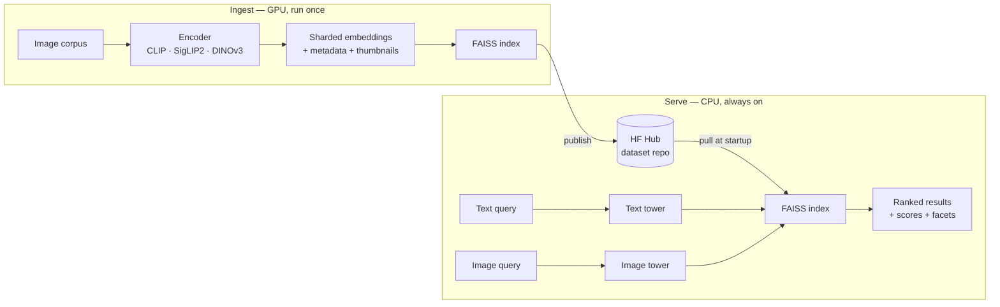

# Multimodal Visual Search

Search a large image collection two ways — by **natural language** ("red leather ankle boots on a
white background") or **by example image** ("find me more like this") — and get back ranked, scored
results in a web UI.

Built on vision foundation models, with an explicit focus on the dimension most CV portfolios skip:
**efficiency, deployment, and honest measurement**. Every speed number below is paired with the
retrieval fidelity it cost.

**▶ [Live demo](https://multimodal-visual-search.ebrahimzadeh-meh.workers.dev)** — type a phrase,
get ranked images. Try *"something to wear to the beach in summer"*: none of those words appear in
any product name, so nothing but embedding space can answer it. No backend — the index, the ranking
and the CLIP text encoder all run in the tab.

```bash
uv sync --all-extras --group dev && uv run vsearch info
```

---

## What it does

| | |
|---|---|
| **Text → image** | CLIP / SigLIP2 shared embedding space — **0.588 R@1** on Flickr30k 1K test |
| **Image → image** | DINOv3 self-supervised features, or fused with CLIP via reciprocal rank fusion |
| **Filtering** | Facet pre-filtering *inside* the FAISS search (colour, category, gender, season…) |
| **Serving** | FastAPI + Gradio in one process, ~45 ms/query on a laptop CPU |

Real results from the running system on the product corpus:

```
query: "silver wrist watch"
  0.302  Titan Women Silver Watch                            [Silver]
  0.299  Carrera Men Dial steel finish strap Silver Watches   [Silver]
  0.298  CASIO EDIFICE Men Black Dial Chronograph Watch       [Black]
```

---

## Architecture

Ingestion is a GPU-bound one-time batch job. Serving a query is a CPU-bound latency job. Treating
them as one program forces you to rent a GPU for a workload that is 99 % idle.



The Space never re-embeds a corpus: cold start is seconds, hosting is free, and ingestion is
reproducible rather than something that happened once on a laptop.

---

## Stack

| Layer | Choice | Why |
|---|---|---|
| Text↔image | `openai/clip-vit-base-patch32` | 512-dim, ungated, fast on CPU |
| Text↔image (quality) | `google/siglip2-base-patch16-224` | Stronger recall, slower |
| Image↔image | `facebook/dinov3-vits16-pretrain-lvd1689m` | Self-supervised, 21 M params, licence-gated |
| Image↔image fallback | `facebook/dinov2-small` | Same 384 dims, so the registry degrades instead of failing |
| Index | FAISS `IndexFlatIP` / `IndexHNSWFlat` | Native Windows wheels, no service to run |
| Runtime | PyTorch + ONNX Runtime | Both behind one encoder interface |
| API / UI | FastAPI + Gradio | One process, one loaded model |
| Packaging | uv + Docker | One-command setup |

Every embedding leaves an encoder **L2-normalised float32**, enforced in one place. Cosine
similarity is then a plain inner product, so `IndexFlatIP` returns cosine scores directly and two
encoders' scores stay comparable.

---

## Corpora

| Role | Corpus | Dataset | Size |
|---|---|---|---|
| Demo | `fashion` | [`benitomartin/fashion-product-images-small-384x512`](https://huggingface.co/datasets/benitomartin/fashion-product-images-small-384x512) | 44,072 @ 384×512, 8 facets |
| Evaluation | `flickr1k` | [`nlphuji/flickr_1k_test_image_text_retrieval`](https://huggingface.co/datasets/nlphuji/flickr_1k_test_image_text_retrieval) | 1,000 images, 5 captions each — **142 MB** |
| Evaluation (full) | `flickr30k` | [`nlphuji/flickr30k`](https://huggingface.co/datasets/nlphuji/flickr30k) | 31,014 images — 4.31 GB |

Flickr30k carries the canonical train/val/test assignment, so restricting to `test` gives the
standard 1000-image / 5000-caption benchmark whose Recall@k is comparable to published CLIP numbers
rather than self-defined.

That assignment lives in a *column*, not in separate files, so reaching those 1000 images through
the full corpus means streaming all 4.31 GB to keep 3 % of it. The same 1000 images are published
standalone at 142 MB, so `flickr1k` is the default evaluation path — identical benchmark, 30× less
transfer, and it runs on a laptop instead of needing a GPU box.

---

## Benchmarks

CLIP ViT-B/32, Intel i7-1255U (10C/12T, no AVX-512), ONNX Runtime threads pinned to 4, 20 runs,
p50 / p95 over warmed iterations.

| runtime | precision | modality | batch | p50 ms | p95 ms | items/s | model MB | parity vs fp32 |
|---|---|---|---|---|---|---|---|---|
| pytorch | fp32 | image | 1 | 69.9 | 120.2 | 13.8 | — | 1.0000 |
| pytorch | fp32 | image | 8 | 347.8 | 451.9 | 22.6 | — | 1.0000 |
| pytorch | fp32 | text | 4 | 30.8 | 44.4 | 127.9 | — | 1.0000 |
| onnxruntime | fp32 | image | 1 | 78.1 | 91.6 | 12.6 | 335 | 1.0000 |
| onnxruntime | fp32 | image | 8 | 506.1 | 553.4 | 15.6 | 335 | 1.0000 |
| onnxruntime | fp32 | text | 4 | 27.8 | 31.3 | 144.5 | 242 | 1.0000 |
| **onnxruntime** | **int8** | **image** | **1** | **55.4** | **68.5** | **16.8** | **84** | **0.9764** |
| onnxruntime | int8 | image | 8 | 354.1 | 369.7 | 22.5 | 84 | 0.9764 |
| onnxruntime | int8 | text | 4 | 14.3 | 16.4 | 282.3 | 61 | **0.8830** |

**Parity** is the mean cosine between a backend's embeddings and the PyTorch fp32 baseline. A
speedup without it is not a result: the index is built in fp32, so a backend that drifts is
answering a different question than the one the index was built for.

### What the numbers actually say

1. **ONNX fp32 is slower than PyTorch here** — 78 vs 70 ms at batch 1, and 506 vs 348 ms at batch 8.
   PyTorch's oneDNN CPU path is very well tuned for Intel and ORT's MLAS does not beat it for
   ViT-B/32 on this chip. "We exported to ONNX and got faster" would have been false.

2. **INT8 is the only real speedup, and only at batch 1** — 55.4 ms vs 69.9 ms (1.26×), at 0.976
   parity. At batch 8 it draws level with PyTorch.

3. **INT8 text is 2.15× faster but drops to 0.883 parity.** That is a large drift against an fp32
   index, and it would move Recall@k.

4. **Model size falls 335 MB → 84 MB (4×)** — the unambiguous win, and the one that matters most on
   a 2-vCPU / 16 GB Space.

**Conclusion: mixed precision, not blanket INT8.** Quantize the *vision* tower — it runs once per
corpus image, quantizes cleanly at 0.976, and drives the 4× size reduction. Keep the *text* tower in
fp32 — it runs once per query, so its 16 ms saving is worth little, while 0.883 parity is expensive.

Reproduce:

```bash
uv run python -m vsearch.bench.run_bench --encoder clip --batch 1 --batch 8 --runs 20 --threads 4
```

---

## Retrieval quality

### Text → image, Flickr30k 1K test (the headline)

The canonical benchmark: 1000 images, 5000 human-written captions, one correct image per caption.

| config | queries | R@1 | R@5 | R@10 | MRR | nDCG@10 |
|---|---|---|---|---|---|---|
| clip / flickr1k / text→image | 5000 | **0.588** | 0.834 | 0.901 | 0.693 | 0.743 |
| clip / flickr1k / text→image **(shuffled control)** | 5000 | 0.0018 | 0.0064 | 0.0108 | 0.004 | 0.006 |

The second row is a **negative control**, and it is the reason to believe the first. It reassigns
every caption to the wrong image and changes nothing else — same encoder, same index, same search,
same metric code — then reports what the pipeline scores on destroyed ground truth. Chance is
1/1000 = 0.0010; it lands at 0.0018.

That matters because the failure mode of a retrieval harness is not a crash. A harness that scores
a query against itself, or lines ranked lists up against the wrong targets, produces a *high* number
and looks like a good result. Only the control separates "the model retrieves" from "the evaluation
leaks".

For calibration: ~30 % R@1 is the figure usually quoted for CLIP ViT-B/32 zero-shot text→image, but
that is **MS-COCO 5K** — a 5× larger candidate pool with terser captions. Flickr30k 1K is the easier
benchmark, so a substantially higher number is expected here, and 0.588 against a 0.0018 control is
consistent rather than suspicious.

```bash
uv run python -m vsearch.eval.run_eval --corpus flickr1k --encoder clip --protocol text --control
```

### Image → image, product corpus

Image→image on the product corpus. Relevance is a **documented proxy**: two products match when
they share `articleType` *and* `baseColour`. This is not human judgement, and the table says so.

| config | queries | R@1 | R@5 | R@10 | MRR | mAP | nDCG@10 |
|---|---|---|---|---|---|---|---|
| clip / fashion / image→image (label proxy) | 39 | 0.158 | 0.547 | 0.718 | 0.445 | 0.398 | 0.490 |
| dinov3 / fashion / image→image (label proxy) | 39 | 0.137 | 0.487 | 0.803 | 0.434 | 0.387 | 0.499 |

Both rows index the **same 96 images** (verified by comparing id sets, not by trusting the run
config), so the only variable is the encoder.

Two caveats stated plainly:

- This ran against a **96-image smoke index**, not the full 44 k corpus. It demonstrates the harness
  end to end; it is not a headline result.
- R@1 looks low because with many relevant items Recall@1 is capped at `1/|relevant|`. For this
  protocol **mAP and nDCG are the honest summaries**, which is why both are reported.

Queries whose item has no label-matched peer are skipped as unscoreable — counting them as 0 would
understate the system, as 1 would overstate it.

### Is DINOv3 actually better? The experiment can't tell.

Reading the table above, DINOv3 leads on Recall@10 by +0.086 and CLIP leads on Recall@5 by +0.060.
Both look like findings. Neither is. A paired bootstrap over the 39 shared queries — resample the
query set 10,000 times, recompute the paired delta each time — puts a 95 % interval on every one:

| metric | clip | dinov3 | delta | 95% CI | verdict |
|---|---|---|---|---|---|
| R@1 | 0.1581 | 0.1368 | -0.0214 | [-0.0897, +0.0300] | within noise |
| R@5 | 0.5470 | 0.4872 | -0.0598 | [-0.2137, +0.0855] | within noise |
| R@10 | 0.7179 | 0.8034 | +0.0855 | [-0.0256, +0.2051] | within noise |
| MRR | 0.4445 | 0.4336 | -0.0110 | [-0.0869, +0.0669] | within noise |
| mAP | 0.3984 | 0.3867 | -0.0118 | [-0.0768, +0.0516] | within noise |
| nDCG@10 | 0.4899 | 0.4990 | +0.0091 | [-0.0594, +0.0806] | within noise |

**Every interval straddles zero.** At 39 queries this corpus slice cannot separate a 21 M-parameter
self-supervised ViT from CLIP's vision tower on the label proxy — the honest conclusion is *no
measurable difference*, and the useful conclusion is that encoder selection needs the full corpus,
not a smoke index. The test is paired (same queries both sides) because a hard query is hard for
both encoders, and treating the two runs as independent samples would throw away most of the signal.

```bash
uv run python -m vsearch.eval.run_eval --corpus fashion --encoder clip --encoder dinov3 --protocol image --compare
```

The seed is fixed, so the interval is reproducible: a confidence bound that moves between runs of
the same data is not evidence anyone can check.

### Reproducing both tables

From a clean checkout, on a laptop CPU, no GPU — roughly 15 minutes end to end:

```bash
uv run vsearch ingest --corpus flickr1k --encoder clip --shard-size 250
```

```bash
uv run vsearch ingest --corpus fashion --encoder clip --limit 96 --shard-size 48 --streaming
```

```bash
uv run vsearch ingest --corpus fashion --encoder dinov3 --limit 96 --shard-size 48 --streaming
```

Then the two eval commands above. Raw output lands in `results/`, named per corpus and protocol
(`metrics-flickr1k-text.md`, `metrics-fashion-image.md`, `metrics-fashion-image-comparison.md`) —
one shared `metrics.md` was last-write-wins, so running one protocol quietly erased the other's
evidence.

---

## Quickstart

```bash
uv sync --all-extras --group dev
```

Index a slice of the product corpus without downloading all 2 GB:

```bash
uv run vsearch ingest --corpus fashion --encoder clip --limit 500 --streaming
```

Serve the UI and API together:

```bash
uv run vsearch serve --port 7860
```

Then open http://localhost:7860. `vsearch info` shows the resolved device and paths;
`vsearch corpora` and `vsearch encoders` list what is available.

Ingest is **resumable** — re-running picks up from the first missing shard rather than starting over.

### API

```bash
curl -s localhost:7860/search/text -H 'content-type: application/json' -d '{"query":"silver wrist watch","k":5}'
```

`POST /search/text` · `POST /search/image` · `GET /facets` · `GET /health` · `GET /docs`

---

## Deployment

Two targets, for two different jobs.

**Hugging Face Space** runs the real thing — FastAPI, Gradio, FAISS, both search directions
including image→image. See [deploy/README.md](deploy/README.md): ingest on a GPU, `vsearch publish`
the index to a Hub dataset repo, and point a Docker Space at it with `VSEARCH_ARTIFACT_REPO`. Free
CPU Spaces sleep after 48 h, so the first visitor after a quiet spell waits out a cold start.

**Cloudflare** ([`web/`](web/)) runs the text→image half as a static page that answers instantly and
never sleeps — which is what a link on a CV needs. There is no server-side component at all:

```
browser                                          Cloudflare
  ├── embeddings.bin        ──cached──┐
  ├── corpus.json + thumbs  ──────────┼── static assets, no Worker
  ├── ranking (dot product, ~2 ms)    ┘
  ├── facet filters (no round trip)
  └── CLIP text tower ─────────────────> Hugging Face CDN (once, then cached)
      int8 ONNX on WebAssembly           Xenova/clip-vit-base-patch32
```

Ranking and filtering happen in the tab against the float32 block written straight out of
`index.faiss` — so the demo and the tables above score the *same bytes*, and changing a filter costs
no request. The text encoder happens in the tab too.

Four consequences worth stating:

- **No vector database.** At these sizes an exact scan is microseconds, and a hosted index would be a
  second copy of the embeddings that nothing checks against the first.
- **No hosted encoder, deliberately.** The first cut of this called Workers AI's
  `@cf/openai/clip-vit-base-patch32`. That model does not exist — Workers AI's catalogue has no CLIP
  at all, and its text-embedding models are useless here because they map into their own space with
  no geometric relation to CLIP's joint one. The alternative, the HF Inference API, needs a token
  that has to be stored and rotated, and has a nastier failure mode than it looks: CLIP ViT-B/32's
  `pooler_output` and `text_embeds` are *both* 512-d, so a wrong-space vector passes a dimension
  check silently. Shipping the encoder to the client removes the secret, the quota and the question.
- **That costs accuracy, and the page says so.** The in-browser tower is int8, not the fp32
  checkpoint the index was built from. `examples.json` carries fp32 vectors for the example queries,
  so the page re-encodes those same strings and reports the gap in its own footer. Measured on this
  laptop: **mean 0.9336** cosine, worst 0.8950, top-1 agreement **5/6**, mean top-10 overlap
  **7.8/10**. That is the same trade-off [the benchmark above](#benchmarks) reports at 0.8830 for
  this project's own int8 export — now paid in public rather than in a table.
- **It degrades instead of breaking.** Example queries ship with their vectors precomputed, so they
  answer before the encoder has been fetched, and still answer if it cannot be fetched at all. The
  page shows a notice and keeps working.

```bash
uv run vsearch export-web --corpus fashion --encoder clip
cd web && npx wrangler login && npx wrangler deploy
uv run vsearch verify-web https://<your-deployment>.workers.dev
```

`verify-web` fetches what the deployment actually serves and scores it against the local FAISS
index — byte-for-byte, then by ranking random probes both ways. A stale or half-finished upload does
not fail loudly on its own; the page still renders a plausible grid of the wrong results.

The export is gitignored: it copies third-party dataset thumbnails, and `wrangler deploy` uploads it
from the working tree, so the repo does not need to redistribute them. Commit it only if you want
Cloudflare's Git integration to build without running the export first.

---

## Limitations

Stated rather than buried:

- **Text→image is measured on 1000 images, not 31,014.** That is the canonical benchmark split, so
  the number is comparable to published work — but a larger index is a harder retrieval problem and
  Recall@k would fall. This is not a 31k-corpus result.
- **The image→image relevance signal is a label proxy**, not human judgement.
- **The encoder comparison is underpowered.** 39 scoreable queries cannot separate CLIP from DINOv3;
  every interval straddles zero. That is reported as "no measurable difference" rather than dressed
  up as a winner, but it also means this project does not yet know which encoder is better here.
- **Benchmarks are single-machine.** The GPU and 2-vCPU Space rows in the intended
  hardware × runtime matrix are not filled in. Numbers were measured on one laptop.
- **FAISS on Windows has no AVX2 kernels** (`faiss.swigfaiss_avx2` is absent from the wheel), so
  Linux index timings will differ from the ones above.
- **DINOv3 is licence-gated**, and the fallback is shape-compatible — same 384 dims, same L2 norm —
  so a substitution changes no assertion downstream. Without an accepted licence and `HF_TOKEN` the
  registry serves `dinov2-small` and logs it, which keeps a public demo alive but means a run
  *labelled* "dinov3" is not proof it ran. Evaluation and benchmarking pass `allow_fallback=False`
  so a reported table cannot be wrong about which model produced it; the tables above were produced
  with the licence accepted and `facebook/dinov3-vits16-pretrain-lvd1689m` genuinely loaded.
- **HNSW graph construction is non-deterministic** under OpenMP threading; recall is asserted at
  ≥ 0.95 against exact search rather than pinned exactly.
- **The live demo searches 2,000 images**, a slice of a 44,072-image corpus, so it shows the
  retrieval behaviour and not the retrieval difficulty. Ranking within 2,000 candidates is an easier
  problem than the numbers above describe. Exporting the whole corpus needs no code change — the
  bundle scales linearly — but 44k vectors is a 88 MB download before the first query, so the
  deployed one is a slice, and calling it a demo of scale would be a lie.
- **The demo's query encoder is int8 and the index is fp32.** They are the same checkpoint but not
  the same weights, and the gap is not negligible: mean 0.9336 cosine, and on the example queries
  top-1 disagrees once in six. The demo mitigates rather than hides this — example queries carry
  fp32 vectors, so the showcased results are exact, and the page reports its own measured parity.
  Typed free text is the degraded path. The fp16 and 4-bit exports would be closer but fail to
  build an ONNX Runtime session on the WASM backend, and fp32 is a 242 MB download.
- **`artifacts/fashion__clip` is shared between the demo and the eval.** The tables above come from
  a 96-image ingest; the deployed bundle comes from a 2,000-image one. They write to the same run
  directory, and the pipeline refuses to merge them — delete it before switching, as its error says.

---

## Development

```bash
uv run ruff check . && uv run mypy src && uv run pytest -m "not slow"
```

271 fast tests, plus 7 marked `slow` that download real checkpoints (run with `-m slow`). CI runs
lint, format, strict types and the fast suite, then builds the Docker image and boots it to confirm
`/health` answers.

## License

MIT
